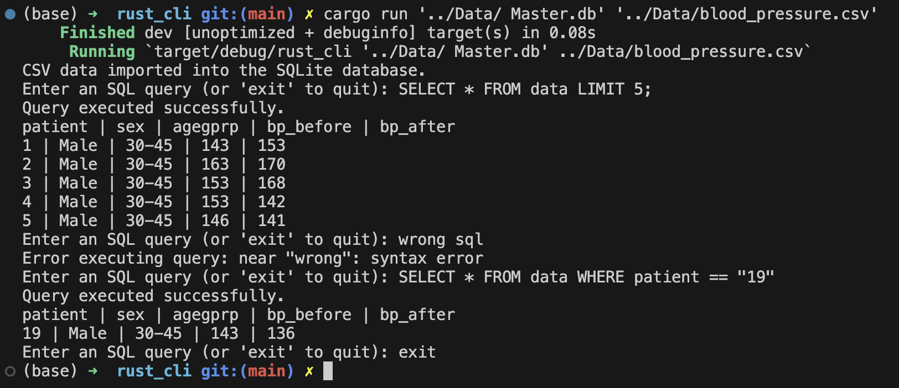
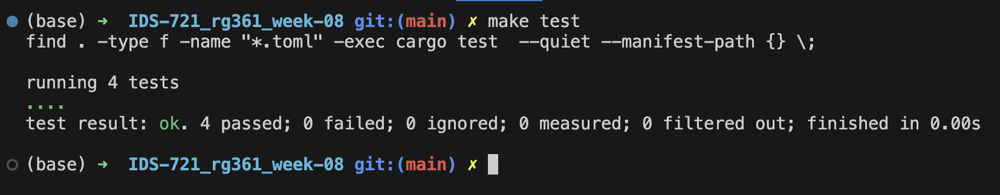
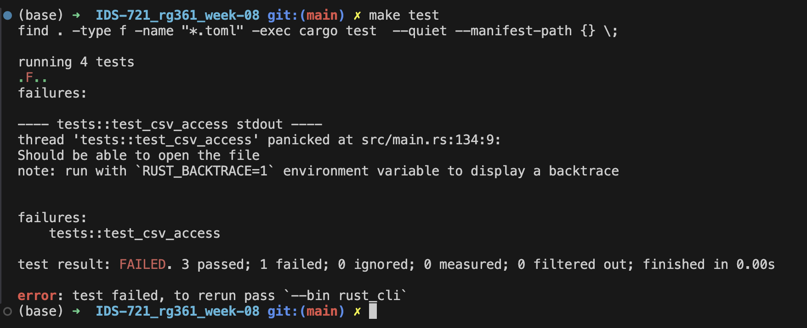

# Rust CLI with Testing

[](https://github.com/nogibjj/IDS-721_rg361_week-08/actions/workflows/cicd.yml)

## Overview
In this project we make use of ``Rust`` to create a ``CLI`` (command line interface) tool which performs CRUD operations on a Database. The rust file also contains unit tests to ensure that any errors are caught and the file is working as expected.

The repository automatically generates an ``optimized Rust binary`` using Github Actions which is uploaded to the root directory as ``Rust_Binary`` and also can be downlaoded from  the Github Actions. CI/CD is also used to automate the testing, liniting etc whenever a change is made to the repository.


## Instructions

The ``main.rs`` file accepts the commands via ``CLI``, the CLI are of the form:

```console
cargo run XX
```
Where 'XX' is the arguments for the file.

if only cargo run is entered, the file displays the prompts for the inputs it requires.
The file accepts regular SQL commands, in case of any invalid command, the file will display an error message.

a sample Dataset of [blood-pressure from Github](https://github.com/Opensourcefordatascience/Data-sets/blob/master/blood_pressure.csv) has been loaded into the data folder which can be used by the user for testing.

after initializing the cli tool with the path for the data file and and the database, the tool reads the data from the csv file and loads into the table. post this the user can perform operations on the table using SQL commands.

Once done, the user can enter 'exit' to quit the program.

Sample Execution:  



## Testing

To ensure that any changes that we make to the file do not break the code, we have added unit tests to the file. To run the tests, execute the following command:
```console
make test
```

or 

```console
cargo test
```

Sample of a successful test run:  


Sample of a failed test run:  


## CI/CD
As mentioned earlier, the repository uses Github Actions to automate the testing, linting, building and copying of the Rust Binary etc. this ensures that the code is always in a good shape and the user can get alerted if there are any issues or if he forgets to run the tests manually.

github actions are used to automate the following processes whenever a change is made to the files in the repository:
   - ``Build`` : creates the Optimized Rust Binary File
   - ``Copy`` : copies the binary file to the root directory of the repository as ``Rust_Binary`` for easier access
   - ``test`` : to test the main.rs file
   - ``format`` : uses ``rustfmt`` to format the python files
   - ``lint`` : uses ``clippy`` to lint the python files
   - ``upload and Download`` : Make the Github Action Rust binary atrifact downloadable
   
     
   **Note** -if all the processes run successfully the following output will be visible in github actions:
   

To manually Build the Optimized Rust Binary, execute the following command:
```console
cargo build --release
```

This will generate the executable in the ``/rust_cli/target/release`` directory and it will be a file with the name ``rust_cli``

